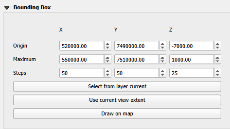
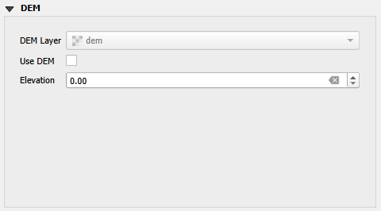
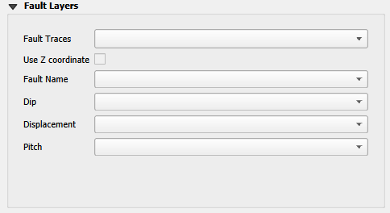
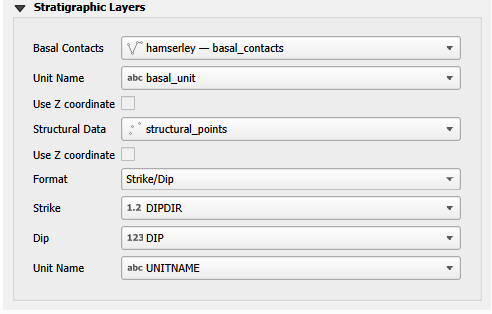
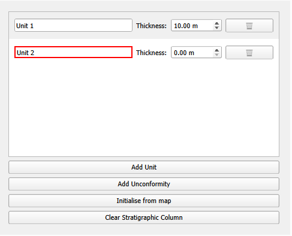
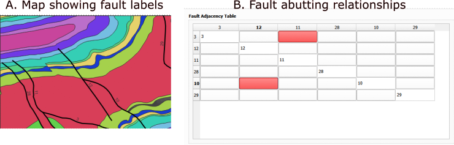
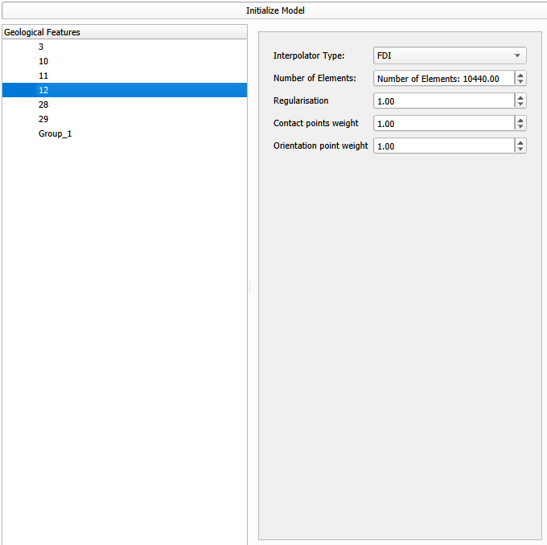

# Plugin interface

## Selecting Layers
The LoopStructural plugin interfaces with QGIS to define the model input data and parameters.

### Bounding box
The bounding box defines the spatial extent of the model and can be either specified manually or automatically by calculating the extent from a selected layer or the current view. Not that the bounding box currently has to be axis aligned, meaning that the bounding box is defined by the minimum and maximum x, y and z coordinates.

### Elevation data
The elevation data is used to define the height of the input data. If a digital elevation model (DEM) is available, the height for all data points will be extracted from the layer. Otherwise a constant elevation can be used.

If the points being modelled contain a Z coordinate, this can be used instead of the DEM or constant elevation and is selected on a per layer basis.

### Fault layers
The faults trace layer is usually a line layer that contains the trace of the fault. The fault trace is used to define the location of the fault in the model. Optional attributes can be used to further constrain the model:
- **fault name** the name of the fault to be used in the model, if this is left blank the feature ID will be used instead.
- **Dip** the dip of the fault, if this is left blank the fault will be assumed to be vertical.
- **Displacement** - The maximum displacement magnitude of the fault. If this is not specified, a default value will be used.
- **Pitch** - defines the pitch of the fault slip vector in the fault surface. If this is left blank a vertical slip vector is assumed and projected onto the fault surface.

### Stratigraphy
Two layers can be used to constrain the stratigraphy of the model:
1. Basal contacts - this layer defines the basal contacts of the stratigraphy. The layer should contain a line layer with the contact traces. The attributes can be used to define the name of the contact.
2. Structural data - this layer defines the structural data that is used to constrain the model. The layer should contain a point layer with the structural data. The attributes can be used to define the orientation of the data, such as dip and dip direction.

## Stratigraphic Column
The stratigraphic column defines the order of the contacts and any unconformable relationships between them. The column is defined by a list of units - these units are ordered from oldest at the bottom to youngest at the top. Unconformities can be inserted between units to define an unconformable relationship. The thicknesses define the true thickness of each unit and are used to parameterise the interpolation. The unit names should match the names of the contacts in the basal contacts layer. Units without basal contacts can be included in the stratigraphic column but will not be constrained by any data.

The stratigraphic column can be initialised from the basal contacts layer by clicking the "Initialise from Layer" button. This will create a column with the contacts in the order they are found in the layer. The column can then be edited to add unconformities or change the order of the units. To change the order of units simply drag the units in the list. To add an unconformity, click the "Add Unconformity" button and drag the unconformity the location in the column.

## Fault topology relationships

The fault-fault relationship table defines the interaction between faults in the model. This is used to define abutting relationships and where one fault is faulted by another fault. The fault table is updated whenever the faults layer or fault name field is changed. For each fault the columns indicate whether the fault is abutting to another fault. By clicking the cell the relationship can be toggled between no relationship (white background), abutting (red) and faulted (green).

## Processing Tools

The plugin provides several QGIS Processing algorithms for working with geological data. These can be accessed through the QGIS Processing Toolbox.

### Paint Stratigraphic Order

The **Paint Stratigraphic Order** algorithm allows you to visualize the stratigraphic order on geology polygons. This tool is useful for:
- Visually debugging the stratigraphic column
- Quality checking unit order
- Creating visualizations of stratigraphic relationships

The algorithm takes:
- **Input Polygons**: A polygon layer containing geological units (e.g., your geology map)
- **Unit Name Field**: The field in your polygon layer that contains unit names
- **Stratigraphic Column**: A table or layer with the stratigraphic column (ordered from youngest to oldest)
- **Paint Mode**: Choose between:
  - **Stratigraphic Order** (0 = youngest, N = oldest): Paints a numeric order onto each polygon
  - **Cumulative Thickness**: Paints the cumulative thickness from the bottom (oldest) unit

The algorithm adds a new field to your polygon layer:
- `strat_order`: The stratigraphic order (when using Stratigraphic Order mode)
- `cum_thickness`: The cumulative thickness in the stratigraphic column (when using Cumulative Thickness mode)

Units that don't match the stratigraphic column will have null values, helping you identify data quality issues.

## Model parameters
Once the layers have been selected, stratigraphic column defined and the fault topology relationships set, the LoopStructural model can be initialised.

Initialise model will create a LoopStructural model with all of the geological features in the model. For each feature in the model the number of interpolation elements (degrees of freedom), the weighting of the regularisation, contact points and orientation weight can be changed.

