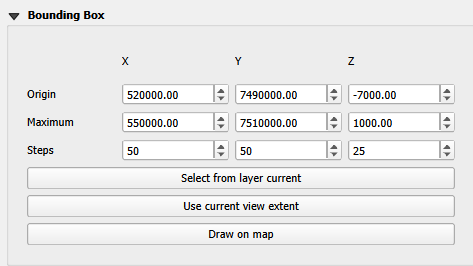
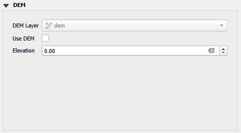
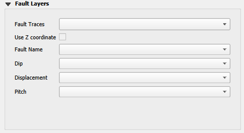
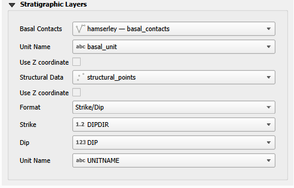
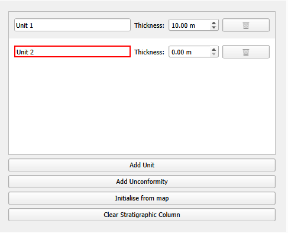
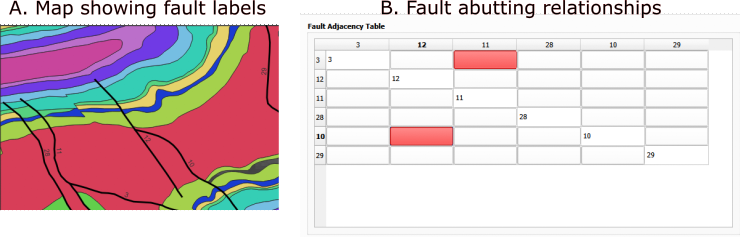
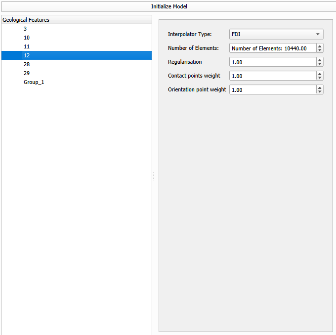

# Plugin interface

## The steps of the dock
The LoopStructural dock has five steps. The step buttons are at the top of the dock. Each button shows its status: a check mark (done), a warning triangle (a problem) or a hollow circle (not done). Point at a button to see the reasons. The footer shows the most important message of the current step, with **Back** and **Next** buttons. The steps are a guide: you can go to any step at any time.

1. **Data**: bounding box, DEM and the source layers. **Convert data...** opens the data conversion tool.
2. **Stratigraphy**: the stratigraphic column. The **Build column** menu has the sorters and Paint Order. The **Derive from map** menu has Basal Contacts, Thickness and Sampler.
3. **Faults**: the fault layer, **Calculate topology...** and the adjacency tables. This step is optional.
4. **Model**: the features and the build of the model.
5. **View**: the 3D view and the **Export** panel. With the setting "separate dock widgets", this step has a button that opens the 3D view dock.

When a build finishes, a message tells you to go to step 5, and the **Next** button in step 4 changes to **Open 3D view**.

### Export
The **Export** panel in step 5 is open when the model is solved. It has three tabs:

- **Surfaces**: one file for each stratigraphic surface and fault surface, in a folder. Formats: VTK (.vtk, .vtp), PLY and STL. A surface with no geometry is skipped.
- **Block model**: a grid that fills the bounding box. Set the number of cells in X, Y and Z. Each cell has the fields `stratigraphy_id` and `unit`. Formats: VTK (.vtk, .vti) and CSV.
- **Cross-section**: a vertical section under a line layer (the selected line, or the first line), or a plane from an origin and a normal. Formats: VTK and CSV.

The exports run in the background and show a message when they finish.

The header of the dock has **Save**, **Open**, **Reset** and **Settings**. They apply to all of the plugin.

The toolbar has three actions: LoopStructural (the dock), 3D View and Help. The **Tools** submenu of the Plugins menu has the map2loop dialogs for advanced users.

## Selecting Layers
The LoopStructural plugin interfaces with QGIS to define the model input data and parameters.

### Bounding box
The bounding box defines the spatial extent of the model and can be either specified manually or automatically by calculating the extent from a selected layer or the current view. Not that the bounding box currently has to be axis aligned, meaning that the bounding box is defined by the minimum and maximum x, y and z coordinates.

### Elevation data
The elevation data is used to define the height of the input data. If a digital elevation model (DEM) is available, the height for all data points will be extracted from the layer. Otherwise a constant elevation can be used.

If the points being modelled contain a Z coordinate, this can be used instead of the DEM or constant elevation and is selected on a per layer basis.

### Fault layers
The faults trace layer is usually a line layer that contains the trace of the fault. The fault trace is used to define the location of the fault in the model. Optional attributes can be used to further constrain the model:
- **fault name** the name of the fault to be used in the model, if this is left blank the feature ID will be used instead.
- **Dip** the dip of the fault, if this is left blank the fault will be assumed to be vertical.
- **Displacement** - The maximum displacement magnitude of the fault. If this is not specified, a default value will be used.
- **Pitch** - defines the pitch of the fault slip vector in the fault surface. If this is left blank a vertical slip vector is assumed and projected onto the fault surface.

### Stratigraphy
The **Source layers** group is at the top of step 2. Two layers can be used to constrain the stratigraphy of the model:
1. Basal contacts - this layer defines the basal contacts of the stratigraphy. The layer should contain a line layer with the contact traces. The attributes can be used to define the name of the contact.
2. Structural data - this layer defines the structural data that is used to constrain the model. The layer should contain a point layer with the structural data. The attributes can be used to define the orientation of the data, such as dip and dip direction.

### Shared layers
You select each layer one time. The plugin keeps the geology layer, the unit name field, the fault traces, the structure layer, the basal contacts and the DEM as shared layers. The map2loop tools (Basal Contacts, Thickness Calculator, Sorter, Sampler and Paint Stratigraphic Order) show these layers as their default values. You can select another layer in a tool for one run.

The geology layer is the layer that you select in the Stratigraphic Column tab. If you select a layer in one of the tools and no geology layer is set, the plugin uses that layer for the other tools. The plugin saves the shared layers with the application state.

The **Source** setting in the **Source layers** group of step 2 selects where the basal contacts come from. The first layer picker follows the setting. Each source keeps its own selection:
- **Calculate from geology polygons** (default). The picker shows polygon layers. It sets the geology layer and the unit name field. The Basal Contacts tool extracts the contacts from the geology layer and the stratigraphic column. When it finishes, the new layer becomes the basal contacts layer of the model.
- **Use a contacts layer**. The picker shows line and point layers. Your own layer is an input. The plugin does not change it, and the Thickness Calculator uses it.

## Stratigraphic Column
The stratigraphic column defines the order of the contacts and any unconformable relationships between them. The column is defined by a list of units - these units are ordered from oldest at the bottom to youngest at the top. Unconformities can be inserted between units to define an unconformable relationship. The thicknesses define the true thickness of each unit and are used to parameterise the interpolation. The unit names should match the names of the contacts in the basal contacts layer. Units without basal contacts can be included in the stratigraphic column but will not be constrained by any data.

The tab has these parts, from top to bottom:

- **Geology layer**: the layer and the unit name field. The plugin shares this layer with the map2loop tools. Under the pickers, a summary shows how many unit names have no match in the layer, and which names.
- **Buttons**: **+ Unit** and **+ Unconformity** add a row at the top of the column. The **Build column** menu adds units from the map: from the basal contacts, or from a layer field. The **More actions** menu has Reverse and Clear. Clear asks for confirmation.
- **The column**: the labels "Youngest" and "Oldest" show the direction. Each unit row has a colour button, a name, a thickness and a remove button. Unconformity rows have a different background. To change the order of units, drag the grip handle of a row. When the column is empty, the list shows how to start.
- **Style map layer**: choose **Style by** unit colour, stratigraphic order or thickness. For the order and the thickness, choose a colour ramp. **Apply** styles the geology layer.

### Out-of-date results
The basal contacts, the calculated thicknesses and the `strat_order` field on a map layer depend on the stratigraphic column and on the layers and settings of the tools that made them. When one of these inputs changes, the Stratigraphic Column tab shows a message, for example "Basal contacts are out of date (the order of the units changed)", with an **Update** button. The button runs the tool again with the settings of the project. The plugin does not calculate again after each change, so you can move many units first. If you move a unit and then move it back, the results stay current.

The plugin records if the thickness of a unit was typed or calculated. The Thickness Calculator does not replace a thickness that you typed. To use a calculated value, set the thickness of the unit to 0 first.

## Fault topology relationships

The fault-fault relationship table defines the interaction between faults in the model. This is used to define abutting relationships and where one fault is faulted by another fault. The fault table is updated whenever the faults layer or fault name field is changed. For each fault the columns indicate whether the fault is abutting to another fault. By clicking the cell the relationship can be toggled between no relationship (white background), abutting (red) and faulted (green).

## Processing Tools

The plugin provides several QGIS Processing algorithms for working with geological data. These can be accessed through the QGIS Processing Toolbox.

### Paint Stratigraphic Order

The **Paint Stratigraphic Order** algorithm allows you to visualize the stratigraphic order on geology polygons. This tool is useful for:
- Visually debugging the stratigraphic column
- Quality checking unit order
- Creating visualizations of stratigraphic relationships

The algorithm takes:
- **Input Polygons**: A polygon layer containing geological units (e.g., your geology map)
- **Unit Name Field**: The field in your polygon layer that contains unit names
- **Stratigraphic Column**: A table or layer with the stratigraphic column (ordered from youngest to oldest)
- **Paint Mode**: Choose between:
  - **Stratigraphic Order** (0 = youngest, N = oldest): Paints a numeric order onto each polygon
  - **Cumulative Thickness**: Paints the cumulative thickness from the bottom (oldest) unit

The algorithm adds a new field to your polygon layer:
- `strat_order`: The stratigraphic order (when using Stratigraphic Order mode)
- `cum_thickness`: The cumulative thickness in the stratigraphic column (when using Cumulative Thickness mode)

Units that don't match the stratigraphic column will have null values, helping you identify data quality issues.

## Model parameters
Once the layers have been selected, stratigraphic column defined and the fault topology relationships set, the LoopStructural model can be initialised.

Initialise model will create a LoopStructural model with all of the geological features in the model. For each feature in the model the number of interpolation elements (degrees of freedom), the weighting of the regularisation, contact points and orientation weight can be changed.

#### Number of interpolation elements

By default the number of elements is "Automatic". The plugin chooses it for each feature from the data of the feature: more constraints, more surfaces and a wider spread of orientations give more elements. The number is rounded to 1 000 and kept between 5 000 and 250 000. The panel of the feature shows the number that was used.

- To keep a number for one feature, clear the "Automatic" check box in the panel of the feature and enter the number. The feature keeps it, and the project file saves it, until you select "Automatic" again.
- To use one fixed number for all features, clear "Automatic" in the plugin settings and enter the number. Features that you set by hand keep their own number.

